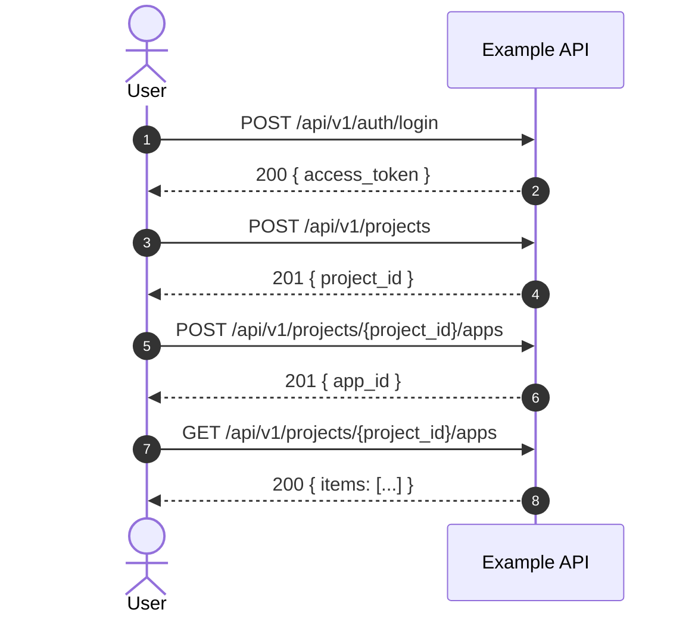
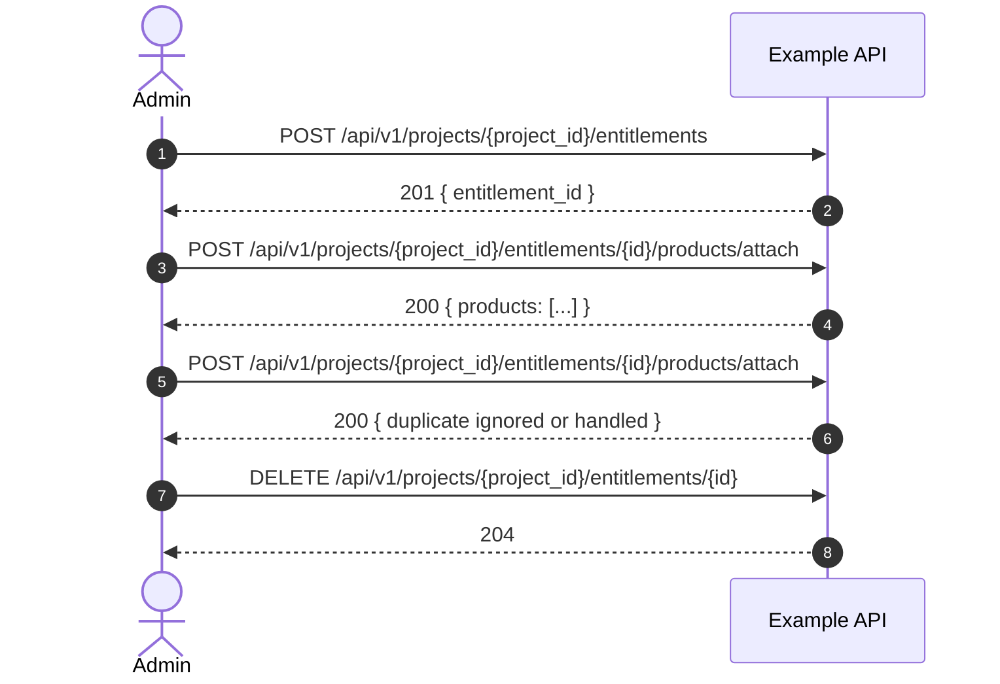
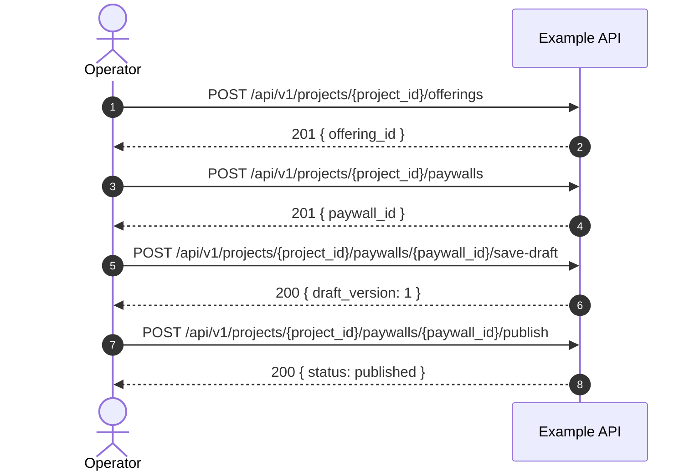
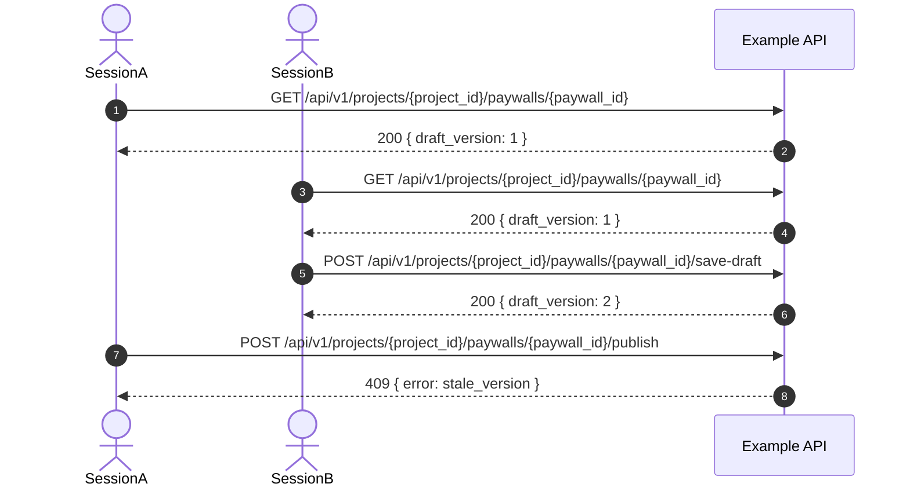

# E2E Journeys — Mermaid Diagrams

> **Purpose:** Example sequence diagrams for advanced chained API journeys.
> **Scope:** These diagrams are starter references only; adapt names, fields, and endpoints to your real API.

---

## J-01: Auth → Project Setup

---

## J-03: Access Policy Assignment

---

## J-04: Bundle + Publishable Surface

---

## J-08: Draft / Publish Concurrency

