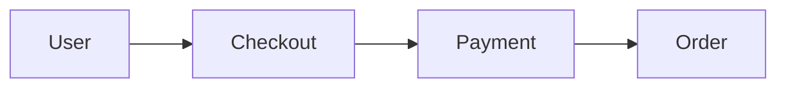

# Hướng dẫn toàn tập về Slidev

Slidev là công cụ làm slide dành cho developer, viết hoàn toàn bằng Markdown, hỗ trợ syntax highlight, diagram (Mermaid/PlantUML), và animation cực mượt.

## 1️⃣ Cài Slidev (1 lần duy nhất)

**Yêu cầu:** Node.js >= 18

Thông thường có thể cài qua template bằng lệnh (sẽ có prompt hỏi cấu hình):
```bash
pnpm create slidev
```
CLI sẽ hỏi:
- Project name: `my-slides`
- Theme: `default`
- Package manager: `pnpm`

Sau khi tạo xong:
```bash
cd my-slides
pnpm install
pnpm run dev
```
Mở browser tại **http://localhost:3030** 👉 Bạn đã có slide chạy realtime.

*(ℹ️ Để cài đặt tự động 1 click bỏ qua các bước hỏi, hãy chạy script `install-slidev.sh` đi kèm hướng dẫn này).*

## 2️⃣ File slide nằm ở đâu

File chính điều khiển toàn bộ presentation là: **`slides.md`**
Mọi chỉnh sửa trong file này sẽ được Slidev hot-reload và hiển thị ngay lập tức lên trình duyệt.

## 3️⃣ Tạo slide cơ bản

Mỗi slide cách nhau bằng ba dấu gạch ngang `---`.

Ví dụ:
```markdown
# Đưa Dự Án Trở Lại Tầm Kiểm Soát

Biến kiến thức trong đầu thành tài sản chung

---

# Hành trình hôm nay

1. Tribal Knowledge
2. Flow Thinking
3. Artifacts
```

## 4️⃣ Animation hiện từng bullet (Incremental Reveal)

Slidev hỗ trợ incremental reveal rất mạnh để text xuất hiện khi bạn bấm Next (rất cần khi thuyết trình).

**Cách 1 (Sử dụng `<v-clicks>` - Dễ nhất và tường minh)**
```markdown
# Hành trình hôm nay

<v-clicks>

- Tribal Knowledge
- Sức mạnh của Flow
- Artifacts
- Ownership
- Hành động

</v-clicks>
```
*Khi trình chiếu: click 1 → Hiện bullet 1; click 2 → Hiện bullet 2...*

**Cách 2 (Khai báo tự động ngầm)**
```markdown
<!-- incremental -->

- Tribal Knowledge
- Flow
- Artifacts
- Ownership
```

## 5️⃣ Presenter Mode (Màn hình diễn giả)

Khi đang chạy trình chiếu Slidev, bạn bấm phím **`o`** (chữ O) trên bàn phím.
Màn hình sẽ chuyển sang **Presenter View** chứa:
- Đồng hồ bấm giờ (Timer)
- Slide tiếp theo (Next slide)
- Ghi chú diễn giả (Speaker notes)
- Giao diện này rât giống với PowerPoint Speaker View.

## 6️⃣ Thêm Speaker Notes

Sử dụng comment HTML `<!--` và `-->` để thêm note. Audience nhìn lên màn hình chiếu sẽ không thấy, chỉ có bạn nhìn thấy ở Presenter Mode.
```markdown
# Tribal Knowledge

Kiến thức nằm trong đầu dev

<!--
Speaker note:
Hỏi audience:
"Bao nhiêu người từng gặp bug mà chỉ có 1 người biết fix?"
-->
```

## 7️⃣ Chia Layout (Cột)

Chia nội dung thành nhiều cột dễ dàng qua cú pháp `::columns::`.
```markdown
# Flow

::columns::

# left
User Journey
Business Flow

# right
Sequence Diagram
State Machine
```

## 8️⃣ Thêm Diagram (Mạnh mẽ)

Slidev hỗ trợ biên dịch rât nhiều loại Diagram như **Mermaid**, **PlantUML**, hoặc công thức toán **LaTeX**.
Chỉ cần bọc code diagram trong markdown codeblock.

Ví dụ tạo một Mermaid flow:
```markdown

```

## 9️⃣ Export / Xuất file

Slidev hỗ trợ xuất ra nhiều định dạng phổ biến để chia sẻ:
- **PDF**
- **PNG**
- **PPTX** (PowerPoint)
- **Static website** (Trang web tĩnh dạng Single Page Application)

Cách export:
```bash
pnpm run build
# hoặc sử dụng CLI trực tiếp:
pnpm dlx slidev export
```

## 🔟 Cách convert slide Marp sang Slidev

Ví dụ bạn đang có `business-flow-overview.marp.md`:

1. Đổi tên file thành `slides.md`
2. Update phần header đầu slide (YAML frontmatter) thành:
   ```yaml
   ---
   theme: default
   title: Business Flow Overview
   ---
   ```
3. Cập nhật các Animation bằng cách bọc nội dung list vào `<v-clicks>`

**Ví dụ slide của bạn sau khi bọc Slidev syntax:**
```markdown
# Hành trình hôm nay

<v-clicks>

- Tribal Knowledge  
  → Cạm bẫy kiến thức bộ lạc

- Sức mạnh của Flow  
  → Nhìn thấy bức tranh lớn

- Artifacts là phương tiện  
  → Giải phóng bộ não

- Ownership  
  → Từ "thực thi" sang "làm chủ"

</v-clicks>
```
*Tác dụng: Khi bạn nói đến đâu, bạn bấm click đến đó. Khán giả sẽ không bị phân tâm đọc trước các ý chưa được trình bày.*

## 11️⃣ Hotkeys / Phím tắt khi trình chiếu

| Phím | Chức năng (Action) |
|---|---|
| `→` | Next slide / Animation tiếp theo |
| `←` | Previous slide / Animation trước đó |
| `Space` | Next |
| `o` | Mở chế độ Presenter (Diễn giả) |
| `f` | Fullscreen (Toàn màn hình) |

## 12️⃣ Vì sao Slidev rât hợp với bạn?

Bạn đang có các thế mạnh:
- Quen viết **Markdown**.
- Sẵn sàng dùng **VSCode**.
- Thích hệ thống hoá qua **flow diagram**.

Slidev hỗ trợ all-in-one: **Markdown + Mermaid + PlantUML + Vue components + Animation mượt mà**.

**✅ Kết luận Workflow tốt nhất:**
VSCode → Slidev (Viết Markdown) → Cài cắm Animation + Presenter Notes → Present trực tiếp trên Browser qua `localhost`.
*Lợi ích: Bạn hoàn toàn không cần đụng đến PowerPoint nữa.*
